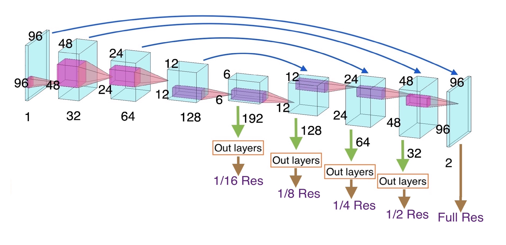

  
  <h1 align="center"> Imperial College London Master's Project </h1>

  
  <h2 align="center">Image Segmentation via Multi-Resolution Convolutional Neural Networks</h2>

In this repository, the Multi resolution Convolutional Neural Network (MCNN) is experimented with.
This project is an extension of [Multi-resolution convolutional neural networks for inverse problems](https://www.nature.com/articles/s41598-020-62484-z).

### Project Aims

- Determine the extent to which MCNNs can be applied to image segmentation.
- Compare state-of-the-art segmentation performance to the performance achievable with MCNNs.

Lung tumour segmentation, from 3D CT scans, is the chosen image segmentation task to tackle in this project.
This is an interesting application of MCNNs for the following reasons:

- MCNNs had not been applied to 3D data before this project. This project uses a custom medical 3D UNet architecture for this.
- The ratio of lung tumour to the overall area of all images in a CT scan is very small, posing a problem for applying MCNNs to this segmentation task.

### Project Conclusions

- Using low resolution outputs in early training epochs allowed the network to converge much faster.
- Using high resolution outputs in later training epochs in necessary to achieve state-of-the-art detection accuracy.
- Using a custom loss function which weights low resolution outputs less and less throughout training can allow the network to achieve a Dice Score which outperform current state-of-the-art results for the 3D Unet without multi-resolution loss.
- MCNN training has a very low cost to training time, since the same number of training steps are completed, whether intermediate states in the network are used or not.

If you'd like to read the full thesis PDF, you can check it out [here](https://github.com/Eschamp01/MCNN_FYP/blob/main/MCNN%20Thesis.pdf)!
